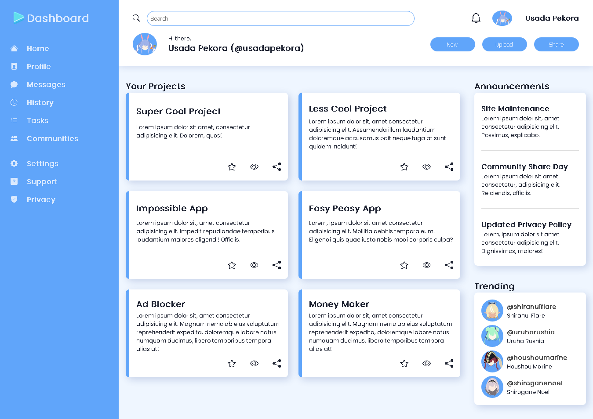

# Admin Dashboard

Admin Dashboard Project for The Odin Project Intermediate HTML and CSS

### Preview

### Links

- The Odin Project: [https://www.theodinproject.com/](https://www.theodinproject.com/)

- Live Demo: [https://nevz9.github.io/admin-dashboard/](https://nevz9.github.io/admin-dashboard/)

- Hololive Icons: [AbnerJ on Twitter](https://twitter.com/AbnerJosueJ/status/1344180445991329793/photo/1)

- Hololive: [Hololive Website](https://en.hololive.tv/)
- Shiranui Flare: [Twitter](https://twitter.com/shiranuiflare?lang=en)
- Houshou Marine: [Twitter](https://twitter.com/houshoumarine?lang=en)
- Usada Pekora: [Twitter](https://twitter.com/usadapekora)
- Uruha Rushia: [Twitter](https://twitter.com/uruharushia?lang=en)
- Shirogane Noel: [Twitter](https://twitter.com/shiroganenoel?lang=en)

### Built with

- HTML5 and CSS3
- CSS Grid

###

This was really tough for me who mainly uses flex, but it's also a great learning experience.
